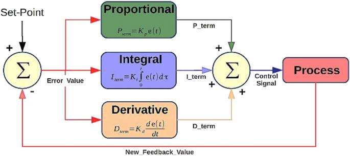

Project: PID Controller
---

### Introduction

*In this project, we'll revisit the lake race track from the [Behavioral Cloning Project](https://github.com/snandasena/behavioral-cloning). This time, however, we'll implement a PID controller in C++ to maneuver the vehicle around the track!*

*The simulator will be provided with the cross-track error (CTE) and the velocity (mph) in order to compute the appropriate steering angle.*

### Discussions

#### PID Controller
* P - Proportional
* I - Intergral
* D - Differential

||  |
|-------------------------------------------------------------|-----------------------------------------------|
| Source: https://thinkautonomous.medium.com/ | Source: Udacity|

#### Steering PID Controller
The steering PID controller analyzes the cross-track error(CTE) provided by the simulator and calculates the steering angle that tries to bring the car back to the centre of the lane line. 

###### P - Proportional
The **P** is the most directly observable effect on the car's behaviour. It causes the car to steer proportionally to the car's distance from the lane centre. Bigger values of P result in faster reactions of the steering angle with respect to the CTE.

###### D - Differential
The **D** counteracts the P component's tendency to overshoot the centre line. A properly tuned D parameter will cause the car to approach the centre line smoothly. Higher values of P also required higher values of D.

###### I - Integral
The **I** counteracts a bias in the CTE which prevents the P-D controller from reaching the centre line. This bias can take several forms, such as a steering drift.

#### Throttle PID Controller
The throttle PID controller was used to controlling the speed of the car via the throttle. The target speed is reduced if there is a case of big CTE and a high steering angle.

###### P - Proportional
The **P** is the most directly observable effect on the car's behaviour. High values of P resulted in quick reactions to changes of the target speed which even allowed the car to brake.

###### D - Differential
The **D** counteracts the P component's tendency to overshoot the target speed.

###### I - Integral
The **I** was set to a small value(0.00009) since the target speed is constantly changing and I observed a tendency to not breaking fast enough

#### Hyperparameter Tuning
I choose the manual method to provide hyperparameters for the PID controller. I tested a lot of parameters and found a few interest parameters for different hardware specs.
Those parameters can be found from [`steer_params.txt`](data/steer_params.txt) and [`throttle_params.txt`](data/throttle_params.txt) files.

### References
* https://www.udacity.com/course/self-driving-car-engineer-nanodegree--nd013
* http://ais.informatik.uni-freiburg.de/teaching/ss18/robotics/index_en.php
* https://github.com/snandasena/path-plnaning-n-localization
* https://github.com/MarkBroerkens/CarND-PID-Control-Project
* https://thinkautonomous.medium.com/

### Acknowledgments
Big thank you to [Udacity](https://www.udacity.com) for providing the template code and simulator for this project.
