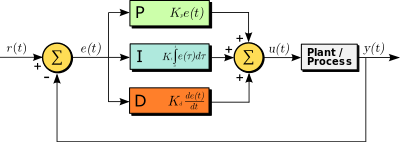
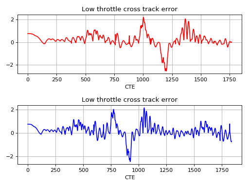

# CarND-Controls-PID
Self-Driving Car Engineer Nanodegree Program

# Driving sequences


| Low throttle  | High throtte |
|---|---|
|  |  |


# PID Control

PID control, or Proportional, integral, Derivative control is a stable control system for controlable parameters based on obseravable parameters of the system. 



The key idea is, given a initial state of the system and a goal state, to reach it with minimum energy waste. Idealy, a step function would be required, but practical physical limitations smooth it, or cause oscilations. 

While the system's input, U(t), may be modeled (approximately) as a step function, such as a throttle immediate change, the system response would filter high frequencies, resulting in a smooth or oscilating pattern. 


## Proportional term

In order to hit the target parameter desired value, the observable parameter error - e(t), in our case, the CTE (cross track error) is measured. 

The error term is linear to the change value in the controlled value. A zero error would yield a zero angle, a positive/negative error would yield positive/negative output control.

Thus, the control would be -Kp * e[t]

## Intergral term

The control system, the steering angle and the throttle, which control the speed, may have natural offsets to it. A control variable of zero steering degrees, may yield a nonzero value. This error accumulates over time and may disturb the proportional control during stabilization and ultimately, cause a steady state bias error term. 

Integrating these errors and adding them to the control variable is designed to eliminate the steady state bias.

The integral control value is -Ki * sum(e[t], t=0..N)

## Derivative control

The derivative control controls the rate of change in the error state, de(t)/dt. The Derivatite control by itself cannot hit the desired target value, but is required in order to stabilize the system. The proportional control variable may come to a state of constant oscilations, stable, increasing or decreasing about the target value. The derivative control variable reduces overshoot and oscilations by penalizing changes in the error rate and adds stability to the system (as can be measured in the state space form of the PID controller)

The integral control value is -Kd * (e[t] - e[t-1])


# Tuning

The PID controller was tuned in two stage

1. Manually (Hueristically)

    1.1. Zero out all parameters - Kp, Ki, Kd
    
    1.2. Find a *non-stable* Proportional value - Kp_*max*

    1.3. Find a stable osciallating (approximately) Kp

        * practically, this is stable and slightly decreases with time
    
    1.4. Increase derivative term Kd until oscillations decrease

    1.5. The above state are repeated until generally satisfactory 

    1.6. Set intergral value - Ki - as 0.01 of Kp

    1.7. Increase Ki until oscillations start

    1.8. Cut Ki by 2

2. Twiddle based

    Once the manual tuning parameters were found and stable, the twiddle algorithm has been incorporated into the code. The number of iterations were set to 1200, in order to practice only on part of the course and not overfit it to the entire course.


# Results

Two throttle values were tested, low & high, respectively.


| Low throttle  | High throtte |
|---|---|
|  |  |


## Cross track errors


As expected, higher throttle values cause more steady state oscillations. However, maximum values were identical in both cases.





Once transitioning from a straight line to a curved course, the PID controller oscillations were subdued quickly (which might cause high jerk), but oscillations were not eliminated.

Moreover, the twiddle algorithm, which favors low average CTE, does not consider steady state small oscillations, which are important to get rid of as well.


# References

[1] [Wikipedia PID controller](https://en.wikipedia.org/wiki/PID_controller)

[2] [Online resetting the simulator](https://github.com/ruktech) 

---

## Dependencies

* cmake >= 3.5
 * All OSes: [click here for installation instructions](https://cmake.org/install/)
* make >= 4.1(mac, linux), 3.81(Windows)
  * Linux: make is installed by default on most Linux distros
  * Mac: [install Xcode command line tools to get make](https://developer.apple.com/xcode/features/)
  * Windows: [Click here for installation instructions](http://gnuwin32.sourceforge.net/packages/make.htm)
* gcc/g++ >= 5.4
  * Linux: gcc / g++ is installed by default on most Linux distros
  * Mac: same deal as make - [install Xcode command line tools]((https://developer.apple.com/xcode/features/)
  * Windows: recommend using [MinGW](http://www.mingw.org/)
* [uWebSockets](https://github.com/uWebSockets/uWebSockets)
  * Run either `./install-mac.sh` or `./install-ubuntu.sh`.
  * If you install from source, checkout to commit `e94b6e1`, i.e.
    ```
    git clone https://github.com/uWebSockets/uWebSockets 
    cd uWebSockets
    git checkout e94b6e1
    ```
    Some function signatures have changed in v0.14.x. See [this PR](https://github.com/udacity/CarND-MPC-Project/pull/3) for more details.
* Simulator. You can download these from the [project intro page](https://github.com/udacity/self-driving-car-sim/releases) in the classroom.

Fellow students have put together a guide to Windows set-up for the project [here](https://s3-us-west-1.amazonaws.com/udacity-selfdrivingcar/files/Kidnapped_Vehicle_Windows_Setup.pdf) if the environment you have set up for the Sensor Fusion projects does not work for this project. There's also an experimental patch for windows in this [PR](https://github.com/udacity/CarND-PID-Control-Project/pull/3).

## Basic Build Instructions

1. Clone this repo.
2. Make a build directory: `mkdir build && cd build`
3. Compile: `cmake .. && make`
4. Run it: `./pid`. 

